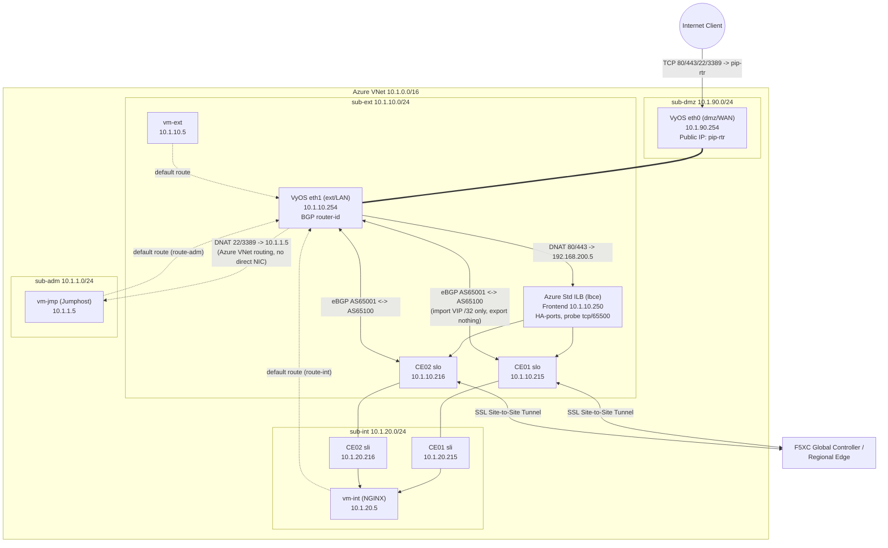

# Architecture

## Overview

The lab simulates an on-premises site connected to F5 Distributed Cloud. A VyOS
router plays the role of the on-prem edge/firewall (NAT + BGP), and two F5XC
Customer Edges (deployed as two independent Secure Mesh Sites, grouped into one
Virtual Site) provide the secure on-ramp to F5XC's global network.

## Network Diagram



> GitHub renders Mermaid diagrams natively.

## IP Addressing Plan

| Resource | Azure name (`<prefix>-...`) | Subnet | IP | Notes |
|---|---|---|---|---|
| VNet | `vnet` | — | `10.1.0.0/16` | |
| Subnet DMZ | `sub-dmz` | — | `10.1.90.0/24` | Only subnet with the Public IP attached |
| Subnet External | `sub-ext` | — | `10.1.10.0/24` | BGP peering + ILB live here |
| Subnet Internal | `sub-int` | — | `10.1.20.0/24` | App/origin side |
| Subnet Admin | `sub-adm` | — | `10.1.1.0/24` | Jumphost only |
| Router eth0 (dmz) | `nic-rtr-dmz` | sub-dmz | `10.1.90.254` | Carries Public IP `pip-rtr`; `ip_forwarding_enabled = true` |
| Router eth1 (ext) | `nic-rtr-ext` | sub-ext | `10.1.10.254` | BGP router-id; `ip_forwarding_enabled = true` |
| vm-ext | `vm-ext` / `nic-ext` | sub-ext | `10.1.10.5` | Plain Ubuntu VM, no special role |
| vm-int | `vm-int` / `nic-int` | sub-int | `10.1.20.5` | NGINX origin server for the demo app |
| Jumphost | `vm-jmp` / `nic-jmp` | sub-adm | `10.1.1.5` | XFCE + xrdp + Firefox; reached only via router DNAT |
| CE01 SLO | `vm-ce01` / `nic-xc-ce01-slo` | sub-ext | `10.1.10.215` | `ip_forwarding_enabled = true`; in Azure LB backend pool |
| CE01 SLI | `nic-xc-ce01-sli` | sub-int | `10.1.20.215` | `ip_forwarding_enabled = true` |
| CE02 SLO | `vm-ce02` / `nic-xc-ce02-slo` | sub-ext | `10.1.10.216` | In Azure LB backend pool |
| CE02 SLI | `nic-xc-ce02-sli` | sub-int | `10.1.20.216` | |
| Azure Internal LB (`lbce`) frontend | `lbce` | sub-ext | `10.1.10.250` | Standard SKU, HA-ports rule, TCP/65500 health probe |
| F5XC HTTP LB VIP | — | (virtual, F5XC-managed) | `192.168.200.5` | Advertised on the Virtual Site's outside network only (`disable_internet_vip = true`) |
| F5XC VIP prefix (BGP-learned) | — | — | `192.168.200.0/24` | Only host routes (`/32`) inside this range are accepted from the CEs |

## Routing, NAT and BGP Design

### Azure UDRs (route tables)

| Route table | Attached to | Route | Next hop |
|---|---|---|---|
| `route-ext` | sub-ext | `0.0.0.0/0` | `10.1.10.254` (VyOS eth1, type VirtualAppliance) |
| `route-ext` | sub-ext | `192.168.200.0/24` | `10.1.10.250` (Azure ILB frontend) |
| `route-int` | sub-int | `0.0.0.0/0` | `10.1.10.254` |
| `route-adm` | sub-adm | `0.0.0.0/0` | `10.1.10.254` |

sub-dmz has no attached UDR — it's the router's WAN-facing subnet.

> Even though the router has no NIC physically in `sub-int` or `sub-adm`, Azure's
> VNet fabric still delivers traffic to `10.1.10.254` correctly because UDRs use the
> router's NIC **IP address** as next hop (`VirtualAppliance`), combined with
> `ip_forwarding_enabled = true` on the router's NICs. This is standard Azure NVA
> design — a single (or in this case, dual) NIC VM can route for subnets it isn't
> directly attached to.

### NAT on VyOS (`cloud-init-rtr.yaml.tpl`)

**Source NAT (outbound internet access):**
```
set nat source rule 100 outbound-interface name 'eth0'
set nat source rule 100 source address '10.1.0.0/16'
set nat source rule 100 translation address 'masquerade'
```
Any traffic from the whole VNet (`10.1.0.0/16`) egressing via `eth0` (DMZ) is
source-NATed behind the router's public IP.

**Destination NAT (inbound port forwarding)** — built dynamically from
`locals.router_dnat_rules` in `main-azvm-vyos.tf`:

| Rule # | Name | Public port | Protocol | Translates to |
|---|---|---|---|---|
| 100 | `app-vip-http` | 80 | tcp | `192.168.200.5:80` (F5XC LB VIP) |
| 101 | `app-vip-https` | 443 | tcp | `192.168.200.5:443` |
| 102 | `jumphost-rdp` | 3389 | tcp | `10.1.1.5:3389` |
| 103 | `jumphost-ssh` | 22 | tcp | `10.1.1.5:22` |

### BGP — VyOS ⇄ F5XC CE

- **Router**: AS `65001` (`router_bgp_asn`), router-id `10.1.10.254`
- **Both CEs**: AS `65100` (`f5xc_bgp_asn`) — same ASN on both, since they're
  redundant instances of the same site
- **Peers** (from `router_bgp_neighbors`):
  - `10.1.10.215` (CE01 SLO) remote-as `65100`
  - `10.1.10.216` (CE02 SLO) remote-as `65100`
- **ECMP**: `maximum-paths ebgp 4` + `bestpath as-path multipath-relax` (needed
  because both peers share the same remote ASN) → router can load-share across
  both CEs for the same `/32` VIP route
- **Route filtering (asymmetric on purpose)**:
  - **Import** (`route-map FROM-XC permit`): only prefixes matching prefix-list
    `XC-VIPS` (`192.168.200.0/24 le 32`) are accepted — i.e. only the F5XC LB
    VIP host route(s), nothing else
  - **Export** (`route-map TO-XC deny`): the router advertises **nothing** to
    the CEs — this BGP session exists purely so the CEs can announce the LB VIP
    to the router, not for the router to expose on-prem routes into F5XC

On the F5XC side (`main-f5xc-bgp.tf`, `volterra_bgp` resources `bgp-ce01`/`bgp-ce02`):
peer address = `10.1.10.254`, peer ASN = `65001`, port `179`, IPv6 disabled
(`disable_v6 = true`).

### Why the Azure Internal Load Balancer (ILB) is required

Azure's SDN does not support a VM as a valid BGP next-hop the way physical/virtual
routers on real networks do — a UDR's `VirtualAppliance` next hop must be a single
fixed IP. Since the F5XC VIP (`192.168.200.5`) can be announced by **either** CE
(active/active or active/standby), the lab adds a **Standard Azure Internal Load
Balancer** (`lbce`) as the fixed next-hop for the `192.168.200.0/24` UDR:

- Frontend: `10.1.10.250` (static, in `sub-ext`)
- Backend pool: CE01 SLO (`10.1.10.215`) + CE02 SLO (`10.1.10.216`)
- Health probe: TCP port `65500`, every 5s, 2 probes
- Rule: protocol `All` (HA ports), floating IP disabled, idle timeout 30 min

> **This ILB is an Azure-only workaround.** On a real on-premises deployment with
> physical/virtual routers speaking real BGP to each CE, this component would not
> be needed — the router would simply pick the best next-hop per its own BGP
> table (as VyOS's `maximum-paths ebgp` setting is designed to do).

### F5XC HTTP Load Balancer / Origin Pool

- HTTP LB `lb-nginx`: domain `mylab.mydomain.com`, port 80, VIP `192.168.200.5`
- Advertised via `advertise_custom` → `virtual_site_with_vip`, network
  `SITE_NETWORK_SPECIFIED_VIP_OUTSIDE` on the Virtual Site (i.e. reachable via
  each CE's **outside**/SLO network — hence why the VyOS BGP peering to `slo`
  IPs is what lets the router reach `192.168.200.5`)
- `disable_internet_vip = true`: the VIP is **not** exposed on F5XC's own global
  anycast network — internet access is only via the VyOS DNAT rules above,
  matching a real "on-prem app, exposed through the local firewall" pattern
- Origin pool `pool-nginx`: single origin server = `vm-int` private IP
  (`10.1.20.5`), `inside_network = true` (reached via the CE's SLI interface),
  port 80, no TLS

## End-to-End Traffic Flow: Public client → demo app

1. Client → `http(s)://<pip-rtr>/` (TCP 80 or 443)
2. VyOS DNAT rule `app-vip-http`/`app-vip-https` rewrites destination to
   `192.168.200.5:80/443`
3. VyOS route lookup: `192.168.200.0/24` → next hop `10.1.10.250` (via `eth1`)
4. Azure Standard ILB HA-ports rule forwards to whichever of CE01/CE02 passes
   the TCP/65500 health probe
5. The receiving CE terminates HTTP LB VIP `192.168.200.5`, applies the
   `lb-nginx` config, forwards to origin `10.1.20.5:80` via its SLI interface
6. NGINX on `vm-int` returns a page showing `$server_addr`, `$remote_addr`,
   `X-Forwarded-For`, `Host`, `URI` and timestamp — ideal for demoing the path live
7. Response returns via the same path in reverse

## Traffic Flow: Admin access to Jumphost

1. Client → `<pip-rtr>:3389` (RDP) or `:22` (SSH)
2. VyOS DNAT rule `jumphost-rdp`/`jumphost-ssh` rewrites destination to `10.1.1.5`
3. Router forwards (IP forwarding enabled) toward `sub-adm` via Azure's VNet
   fabric — no direct NIC needed in that subnet
4. Jumphost (`vm-jmp`) has default route via `route-adm` → `10.1.10.254`, so
   the return path also transits the router (and gets un-NATed automatically
   by conntrack)

## Traffic Flow: Outbound internet from any internal VM (e.g., `apt-get update`)

1. `vm-int`/`vm-ext`/`vm-jmp` → default route → VyOS (`10.1.10.254`)
2. VyOS source-NAT rule 100 masquerades `10.1.0.0/16` → public IP `pip-rtr` on `eth0`
3. Returns via the same path (stateful NAT)

---

## Related Documentation

- [⬅ Back to Documentation Index](./README.md)
- [Prerequisites](./20-prerequisites.md) — complete this before deploying
- [Troubleshooting](./30-troubleshooting.md) — inspect traffic once deployed
