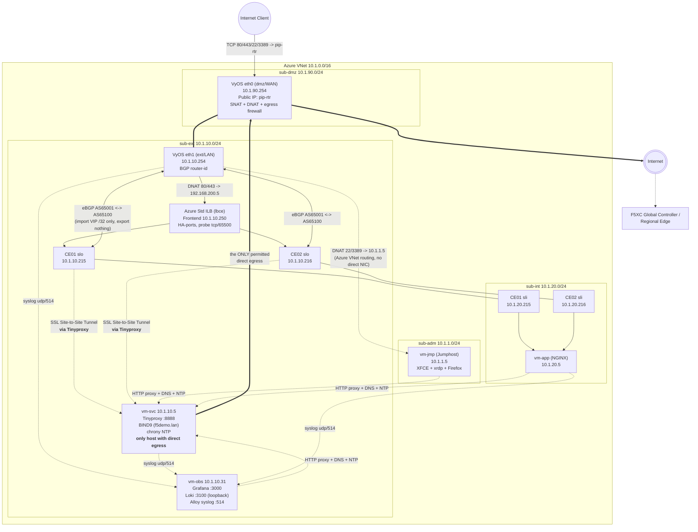

# Architecture

## Overview

The lab simulates an on-premises site connected to F5 Distributed Cloud. A VyOS
router plays the role of the on-prem edge/firewall (NAT + BGP + egress filtering),
and two F5XC Customer Edges (deployed as two independent Secure Mesh Sites v2,
grouped into one Virtual Site) provide the secure on-ramp to F5XC's global network.

Beyond the network path itself, the lab reproduces three things a real on-prem
site always has and a naive cloud lab usually skips:

- **A closed egress policy** — no VM has a public IP and no VM may reach the
  Internet directly. Exactly one host (`vm-svc`) is exempted on the router's
  firewall; everything else must go through the HTTP proxy running on it.
- **Local infrastructure services** — an internal DNS zone (BIND9), an NTP
  server (chrony) and an HTTP/HTTPS forward proxy (Tinyproxy), all on `vm-svc`.
  See [40-shared-services.md](./40-shared-services.md).
- **Central logging** — a dedicated observability VM running Loki, Grafana and
  Alloy, receiving syslog from the router and the Linux VMs.
  See [50-observability.md](./50-observability.md).

The F5XC CEs are subject to the same policy: they register to the F5XC
Global Controller *through Tinyproxy*, and use the lab's own DNS and NTP.

## Network Diagram



> GitHub renders Mermaid diagrams natively.

## IP Addressing Plan

| Resource | Azure name (`<prefix>-...`) | Subnet | IP | Notes |
|---|---|---|---|---|
| VNet | `vnet` | — | `10.1.0.0/16` | |
| Subnet DMZ | `sub-dmz` | — | `10.1.90.0/24` | Only subnet with the Public IP attached |
| Subnet External | `sub-ext` | — | `10.1.10.0/24` | BGP peering, ILB, shared services and observability live here |
| Subnet Internal | `sub-int` | — | `10.1.20.0/24` | App/origin side |
| Subnet Admin | `sub-adm` | — | `10.1.1.0/24` | Jumphost only |
| Router eth0 (dmz) | `nic-rtr-dmz` | sub-dmz | `10.1.90.254` | Carries Public IP `pip-rtr`; `ip_forwarding_enabled = true` |
| Router eth1 (ext) | `nic-rtr-ext` | sub-ext | `10.1.10.254` | BGP router-id; `ip_forwarding_enabled = true` |
| vm-svc | `vm-svc` / `nic-svc` | sub-ext | `10.1.10.5` | **Shared services**: Tinyproxy, BIND9, chrony. Only host allowed direct egress |
| vm-obs | `vm-obs` / `nic-obs` | sub-ext | `10.1.10.31` | **Observability**: Loki + Grafana + Alloy |
| vm-app | `vm-app` / `nic-app` | sub-int | `10.1.20.5` | NGINX origin server for the demo app |
| Jumphost | `vm-jmp` / `nic-jmp` | sub-adm | `10.1.1.5` | XFCE + xrdp + Firefox; reached only via router DNAT |
| CE01 SLO | `vm-ce01` / `nic-xc-ce01-slo` | sub-ext | `10.1.10.215` | `ip_forwarding_enabled = true`; in Azure LB backend pool |
| CE01 SLI | `nic-xc-ce01-sli` | sub-int | `10.1.20.215` | `ip_forwarding_enabled = true` |
| CE02 SLO | `vm-ce02` / `nic-xc-ce02-slo` | sub-ext | `10.1.10.216` | `ip_forwarding_enabled = true`; in Azure LB backend pool |
| CE02 SLI | `nic-xc-ce02-sli` | sub-int | `10.1.20.216` | `ip_forwarding_enabled = true` |
| Azure Internal LB (`lbce`) frontend | `lbce` | sub-ext | `10.1.10.250` | Standard SKU, HA-ports rule, TCP/65500 health probe (`azure_lbce_ip`) |
| F5XC HTTP LB VIP | — | (virtual, F5XC-managed) | `192.168.200.5` | Advertised on the Virtual Site's outside network only (`disable_internet_vip = true`) |
| F5XC VIP prefix (BGP-learned) | — | — | `192.168.200.0/24` | Only host routes (`/32`) inside this range are accepted from the CEs |

### Service ports summary

| Host | Service | Port | Reachable from |
|---|---|---|---|
| `vm-svc` `10.1.10.5` | Tinyproxy (HTTP/HTTPS forward proxy) | `8888/tcp` (`tinyproxy_port`) | whole VNet (`Allow 10.1.0.0/16`) |
| `vm-svc` `10.1.10.5` | BIND9 (authoritative `f5demo.lan` + recursive) | `53/udp,tcp` | whole VNet (`acl "lab"`) |
| `vm-svc` `10.1.10.5` | chrony (NTP server) | `123/udp` | whole VNet (`allow 10.1.0.0/16`) |
| `vm-obs` `10.1.10.31` | Grafana UI | `3000/tcp` | whole VNet (default login `admin` / `admin`) |
| `vm-obs` `10.1.10.31` | Alloy syslog receiver | `514/udp` | whole VNet |
| `vm-obs` `10.1.10.31` | Alloy pipeline UI | `12345/tcp` | whole VNet |
| `vm-obs` `127.0.0.1` | Loki API | `3100/tcp` | **loopback only** — reached through Grafana |
| `vm-app` `10.1.20.5` | NGINX origin | `80/tcp` | VNet + CE SLI |
| CE SLO `.215`/`.216` | Azure ILB health probe | `65500/tcp` | Azure LB infrastructure |

## Routing, NAT and BGP Design

### Azure UDRs (route tables)

| Route table | Attached to | Route | Next hop |
|---|---|---|---|
| `route-ext` | sub-ext | `0.0.0.0/0` | `10.1.10.254` (VyOS eth1, type VirtualAppliance) |
| `route-ext` | sub-ext | `192.168.200.0/24` | `10.1.10.250` (Azure ILB frontend) |
| `route-int` | sub-int | `0.0.0.0/0` | `10.1.10.254` |
| `route-adm` | sub-adm | `0.0.0.0/0` | `10.1.10.254` |

sub-dmz has no attached UDR — it's the router's WAN-facing subnet.

> Even though the router has no NIC physically in `sub-int` or `sub-adm`, Azure's
> VNet fabric still delivers traffic to `10.1.10.254` correctly because UDRs use the
> router's NIC **IP address** as next hop (`VirtualAppliance`), combined with
> `ip_forwarding_enabled = true` on the router's NICs. This is standard Azure NVA
> design — a single (or in this case, dual) NIC VM can route for subnets it isn't
> directly attached to.

### VyOS static route for intra-VNet traffic

```
set protocols static route '10.1.0.0/16' next-hop '10.1.10.1'
```

Templated from `azure_cidr_vnet` and `cidrhost(azure_cidr_sub_ext, 1)`. Without it,
subnets the router is not directly attached to (`sub-int`, `sub-adm`) would be
reached through the default route on `eth0`: a DNAT'd session would leave on `eth0`
while the reply came back on `eth1`. Conntrack copes with that asymmetry, but it
breaks the moment source-validation is enabled.

### NAT on VyOS (`cloud-init-rtr.yaml.tpl`)

**Source NAT (outbound internet access):**
```
set nat source rule 100 outbound-interface name 'eth0'
set nat source rule 100 source address '10.1.0.0/16'
set nat source rule 100 translation address 'masquerade'
```
The source address is templated from `azure_cidr_vnet`. Any traffic from the
whole VNet (`10.1.0.0/16`) egressing via `eth0` (DMZ) is
source-NATed behind the router's public IP. Note that SNAT alone no longer grants
Internet access — the forward firewall below decides *who* is allowed to reach it.

**Destination NAT (inbound port forwarding)** — built dynamically from
`locals.router_dnat_rules` in `main-azvm-vyos.tf`:

| Rule # | Name | Public port | Protocol | Translates to |
|---|---|---|---|---|
| 100 | `app-vip-http` | 80 | tcp | `192.168.200.5:80` (F5XC LB VIP) |
| 101 | `app-vip-https` | 443 | tcp | `192.168.200.5:443` |
| 102 | `jumphost-rdp` | 3389 | tcp | `10.1.1.5:3389` |
| 103 | `jumphost-ssh` | 22 | tcp | `10.1.1.5:22` |

### Egress firewall on VyOS (forward filter)

This is the piece that makes the lab behave like a real perimeter: **only the
proxy VM may open new connections to the Internet.** Everything else is dropped
and logged, which is what feeds the "Firewall drops" panels in Grafana.

| Rule | Action | Match | Logged |
|---|---|---|---|
| 10 | accept | state `established` + `related` | no (would be millions of lines) |
| 20 | accept | out-iface `eth0`, source `10.1.10.5` (from `locals.router_egress_allowed`) | yes |
| 90 | drop | out-iface `eth0`, source `10.1.0.0/16` | yes |
| default | accept | — | — |

Key points:

- The filter applies to the **FORWARD chain only**, so the router's own traffic
  and anything staying inside the VNet are untouched. Intra-VNet traffic never
  reaches the router anyway: the Azure VNet system route is more specific than
  the `0.0.0.0/0` UDR pointing here.
- **Rule 10 must come before rule 90.** Replies to inbound DNAT'd sessions
  (RDP/SSH to the jumphost, 80/443 to the XC VIP) leave via `eth0` with a VNet
  source address and would otherwise match rule 90 and be dropped.
- The allow list is `locals.router_egress_allowed` in `main-azvm-vyos.tf`. Add an
  entry there — e.g. a CE SLO address — to exempt another host without touching
  the cloud-init template. Rules are numbered `20 + index`.
- Dropped packets are logged by the kernel with the prefix `FWD-filter-90-D`,
  which is exactly the string the Grafana dashboard greps for.

See [40-shared-services.md](./40-shared-services.md) for the proxy side of this
policy.

### Remote syslog from the router

```
set system syslog remote '10.1.10.31' facility all level 'info'
set system syslog remote '10.1.10.31' protocol 'udp'
set system syslog remote '10.1.10.31' port '514'
```

`syslog_host` is templated from `azure_nic_obs_ip_addr`. Two notes worth knowing:

- The config node is `remote`, **not** `host` — VyOS 1.4 renamed it and the old
  form silently fails.
- FRR emits `%ADJCHANGE` (BGP neighbour up/down) at *informational*, but VyOS
  renders `log syslog notifications` by default, so BGP would look silent in Loki
  even though the syslog path works. There is no CLI knob: VyOS switches on the
  presence of `/tmp/vyos.frr.debug`. The bootup script touches that file (and
  applies it live with `vtysh`) on **every** boot, deliberately outside the
  one-shot `MARKER` guard, because `/tmp` is wiped on reboot.

### BGP — VyOS ⇄ F5XC CE

- **Router**: AS `65001` (`router_bgp_asn`), router-id `10.1.10.254`
  (templated from `azure_nic_rtr_ext_ip_addr`, i.e. always the eth1 address)
- **Both CEs**: AS `65100` (`f5xc_bgp_asn`) — same ASN on both, since they're
  redundant instances of the same service
- **Peers** (from `router_bgp_neighbors`):
  - `10.1.10.215` (CE01 SLO) remote-as `65100`
  - `10.1.10.216` (CE02 SLO) remote-as `65100`
- **ECMP**: `maximum-paths ebgp 4` + `bestpath as-path multipath-relax` (needed
  because both peers share the same remote ASN) → router can load-share across
  both CEs for the same `/32` VIP route
- **Route filtering (asymmetric on purpose)**:
  - **Import** (`route-map FROM-XC permit`): only prefixes matching prefix-list
    `XC-VIPS` (`192.168.200.0/24 le 32`) are accepted — i.e. only the F5XC LB
    VIP host route(s), nothing else
  - **Export** (`route-map TO-XC deny`): the router advertises **nothing** to
    the CEs — this BGP session exists purely so the CEs can announce the LB VIP
    to the router, not for the router to expose on-prem routes into F5XC
  - `soft-reconfiguration inbound` is enabled on both peers, so
    `show ip bgp neighbors <ip> received-routes` shows pre-filter routes
- `log-neighbor-changes` is enabled so adjacency flaps reach Loki

On the F5XC side (`main-f5xc-bgp.tf`, `volterra_bgp` resources `bgp-ce01`/`bgp-ce02`):
peer address = `10.1.10.254`, peer ASN = `65001`, port `179`, IPv6 disabled
(`disable_v6 = true`), BFD disabled, no MD5 authentication. Each object binds to
the site's `eth0` interface object, whose name is derived as
`ves-io-securemesh-site-v2-<site>-network-<vm>-eth0-0`.

### Why the Azure Internal Load Balancer (ILB) is required

Azure's SDN does not support a VM as a valid BGP next-hop the way physical/virtual
routers on real networks do — a UDR's `VirtualAppliance` next hop must be a single
fixed IP. Since the F5XC VIP (`192.168.200.5`) can be announced by **either** CE
(active/active or active/standby), the lab adds a **Standard Azure Internal Load
Balancer** (`lbce`) as the fixed next-hop for the `192.168.200.0/24` UDR:

- Frontend: `10.1.10.250` (static, in `sub-ext`)
- Backend pool: CE01 SLO (`10.1.10.215`) + CE02 SLO (`10.1.10.216`)
- Health probe: TCP port `65500`, every 5s, 2 probes
- Rule: protocol `All` (HA ports), floating IP disabled, idle timeout 30 min

> **This ILB is an Azure-only workaround.** On a real on-premises deployment with
> physical/virtual routers speaking real BGP to each CE, this component would not
> be needed — the router would simply pick the best next-hop per its own BGP
> table (as VyOS's `maximum-paths ebgp` setting is designed to do).

## F5 Distributed Cloud Configuration

### Secure Mesh Sites v2 (`main-f5xc-smsv2.tf`)

Two independent sites, `<prefix>-site-01` and `<prefix>-site-02`, in the `system`
namespace, each with a single Control node (`enable_ha = false`), `eth0` as the
site-local (outside/SLO) network and `eth1` as the site-local-inside (SLI) network.
`tunnel_type = SITE_TO_SITE_TUNNEL_SSL`.

Each site also carries the lab's closed-egress constraints:

```hcl
custom_proxy {
  proxy_ip_address = <vm-svc private IP>   # 10.1.10.5
  proxy_port       = var.tinyproxy_port    # 8888
  enable_re_tunnel = true
}

dns_ntp_config {
  custom_dns { dns_servers = [<vm-svc private IP>] }
  custom_ntp { ntp_servers = [<vm-svc private IP>] }
}
```

This is what allows the CEs to register and keep their RE tunnel up even though
the VyOS firewall drops their direct egress — **including** the site-to-site
tunnel itself (`enable_re_tunnel = true`). It also means a broken Tinyproxy,
BIND or chrony on `vm-svc` will stall CE registration, so check those first when
a CE never comes online.

Registration itself uses an SMSv2 **site token** per site (`volterra_token`,
`type = 1`), injected into each CE VM through cloud-init at `/etc/vpm/user_data`.

### Virtual Site and labels

- Known Label key `<prefix>-vsite-label-key` and value `<prefix>-vsite-label-value`
  are **created by Terraform** in the `shared` namespace (`volterra_known_label_key`
  / `volterra_known_label`). They are derived from `prefix` — there is no separate
  tfvars variable for them.
- Both sites are tagged with that label (plus `ves.io/provider = ves-io-AZURE`).
  The `labels` attribute is under `lifecycle { ignore_changes }`, so console-side
  label edits will not be reverted by Terraform.
- Virtual Site `<prefix>-vsite` (namespace `shared`, `site_type = CUSTOMER_EDGE`)
  selects them with the expression
  `<prefix>-vsite-label-key in (<prefix>-vsite-label-value)`.

### HTTP Load Balancer / Origin Pool

- HTTP LB `<prefix>-lb-nginx` in your own namespace (`f5xc_namespace_name`),
  port 80, `dns_volterra_managed = false`
- **Domains**: `f5xc_lb_nginx_fqdn` is a *list*. The example ships two names — one
  "external" name and one that ends in the internal DNS zone, e.g.
  `["mylab.mydomain.com", "mylab.f5demo.lan"]`. Any name in that list ending in
  `.<dns_internal_zone>` automatically gets an A record in BIND pointing at the
  VIP (see [40-shared-services.md](./40-shared-services.md)), so the app is
  reachable by name from inside the lab.
- Advertised via `advertise_custom` → `virtual_site_with_vip`, network
  `SITE_NETWORK_SPECIFIED_VIP_OUTSIDE` on the Virtual Site (i.e. reachable via
  each CE's **outside**/SLO network — hence why the VyOS BGP peering to `slo`
  IPs is what lets the router reach `192.168.200.5`)
- The VIP is **not** exposed on F5XC's own global anycast network — internet
  access is only via the VyOS DNAT rules above, matching a real "on-prem app,
  exposed through the local firewall" pattern
- Origin pool `<prefix>-pool-nginx`: single origin server = `vm-app` private IP
  (`10.1.20.5`), `inside_network = true` (reached via the CE's SLI interface),
  port 80, no TLS, `LOCAL_PREFERRED` endpoint selection, round-robin

## Boot and Dependency Order

Because nothing can reach the Internet until the router is up, and nothing but
the router can reach it until Tinyproxy is up, the VMs have an explicit Terraform
dependency chain:

```
vm-rtr  (SNAT + egress firewall)
  └── vm-svc  (Tinyproxy + BIND + chrony)
        ├── vm-app  (NGINX)
        ├── vm-jmp  (XFCE/xrdp desktop)
        └── vm-obs  (Loki + Grafana + Alloy)
```

Every Linux VM's cloud-init opens with the same retry loop — up to 60 attempts,
20 s apart (20 minutes) — around `apt-get update`, so a slow router or proxy
delays provisioning instead of breaking it:

```bash
apt-get update -y -o APT::Update::Error-Mode=any
```

`APT::Update::Error-Mode=any` matters: plain `apt-get update` exits 0 even when
every mirror is unreachable, so without it the loop would break on the first
attempt and the package installs would fail.

Two more ordering rules used consistently across the templates:

- **DNS is switched last.** The lab resolver only knows the root hints and
  `f5demo.lan`, so `99-lab-dns.yaml` is staged in `/root` and only installed into
  `/etc/netplan` at the very end of `runcmd`. Azure DHCP DNS stays in use for the
  whole of provisioning.
- **dpkg conffiles are staged, not pre-written.** BIND's `named.conf.*` and
  NGINX's default site are written to `/root` and copied into place *after* the
  package install, otherwise the install turns into a conffile conflict.

## End-to-End Traffic Flow: Public client → demo app

1. Client → `http(s)://<pip-rtr>/` (TCP 80 or 443)
2. VyOS DNAT rule `app-vip-http`/`app-vip-https` rewrites destination to
   `192.168.200.5:80/443`
3. VyOS route lookup: `192.168.200.0/24` → next hop `10.1.10.250` (via `eth1`)
4. Azure Standard ILB HA-ports rule forwards to whichever of CE01/CE02 passes
   the TCP/65500 health probe
5. The receiving CE terminates HTTP LB VIP `192.168.200.5`, applies the
   `lb-nginx` config, forwards to origin `10.1.20.5:80` via its SLI interface
6. NGINX on `vm-app` returns a plain-text page showing `$server_addr`,
   `$remote_addr`, `X-Forwarded-For`, `Host`, `URI` and timestamp — ideal for
   demoing the path live. The same request is logged to Loki (see below).
7. Response returns via the same path in reverse

## Traffic Flow: Internal client → demo app by name

1. On the Jumphost, browse `http://mylab.f5demo.lan/` (whichever name from
   `f5xc_lb_nginx_fqdn` ends in the internal zone)
2. BIND on `vm-svc` answers with the VIP `192.168.200.5` — the record is
   generated from `f5xc_lb_nginx_vip`, so it cannot drift
3. Firefox's proxy policy lists `${vip_cidr}` and `.f5demo.lan` in `Passthrough`,
   so the request goes **direct**, not through Tinyproxy (which could not reach
   the VIP anyway)
4. Default route `route-adm` → VyOS → BGP-learned `192.168.200.5/32` → ILB → CE
   → origin. Same path as above, minus the DNAT hop.

## Traffic Flow: Admin access to Jumphost

1. Client → `<pip-rtr>:3389` (RDP) or `:22` (SSH)
2. VyOS DNAT rule `jumphost-rdp`/`jumphost-ssh` rewrites destination to `10.1.1.5`
3. Router forwards (IP forwarding enabled) toward `sub-adm` via Azure's VNet
   fabric — no direct NIC needed in that subnet
4. Jumphost (`vm-jmp`) has default route via `route-adm` → `10.1.10.254`, so
   the return path also transits the router (and gets un-NATed automatically
   by conntrack). Rule 10 (`established`/`related`) is what keeps that reply
   from being dropped by the egress filter.
5. From the Jumphost, `ssh lab@10.1.20.5` (or any `*.f5demo.lan` name) works
   with no password: Terraform's generated ED25519 key is installed at
   `~/.ssh/id_ed25519`, with an `~/.ssh/config` entry disabling host-key checking
   for `10.1.*` and `*.f5demo.lan`

## Traffic Flow: Outbound internet from an application VM (e.g., `apt-get update`)

1. `vm-app` / `vm-jmp` / `vm-obs` send the request to Tinyproxy at
   `10.1.10.5:8888` — configured via `/etc/apt/apt.conf.d/00-lab-proxy`,
   `/etc/environment`, Firefox policy, and `snap set system proxy.*`
2. Tinyproxy resolves the name via BIND on the same host and opens the upstream
   connection from `10.1.10.5`
3. Default route `route-ext` → VyOS `10.1.10.254`
4. VyOS forward filter **rule 20** matches source `10.1.10.5` → accept (logged)
5. VyOS source-NAT rule 100 masquerades → public IP `pip-rtr` on `eth0`
6. Returns via the same path (stateful NAT, matched by rule 10)

A VM trying to bypass the proxy instead hits **rule 90**: the packet is dropped
and logged with `FWD-filter-90-D`, and shows up within seconds in the Grafana
"Firewall drops" panels.

## Traffic Flow: Logs

```
VyOS  (kernel firewall + FRR/BGP)  --udp/514-->
vm-svc (rsyslog: tinyproxy, named, chronyd, sshd)  --udp/514-->   Alloy on vm-obs
vm-app (rsyslog + NGINX native syslog)  --udp/514-->              --> Loki --> Grafana
```

Details, label scheme and ready-made LogQL queries are in
[50-observability.md](./50-observability.md).

---

## Related Documentation

- [⬅ Back to Documentation Index](./README.md)
- [Prerequisites](./20-prerequisites.md) — complete this before deploying
- [Shared services](./40-shared-services.md) — proxy, DNS, NTP and the egress policy
- [Observability](./50-observability.md) — Loki, Grafana, Alloy
- [Troubleshooting](./30-troubleshooting.md) — inspect traffic once deployed
