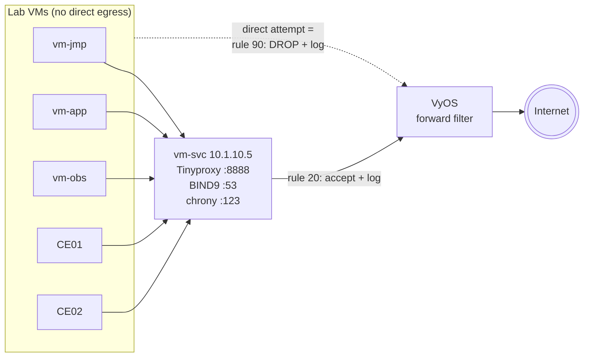

# Shared Services — Proxy, DNS, NTP and the Egress Policy

Everything in this document runs on a single VM, **`<prefix>-vm-svc`
(`10.1.10.5`)**, provisioned by `cloud-init-svc.yaml.tpl` and wired up from
`main-azvm-services.tf`.

That VM plays the role the "services DMZ" host plays in a real on-prem site: it
is the only machine allowed to talk to the Internet directly, and in exchange it
provides the proxy, the resolver and the clock for everything else.

## Why this exists

Without it, an Azure lab gives every VM transparent Internet access, which is
nothing like an enterprise network. With it, the lab exercises the things that
actually break in customer environments: proxy configuration, split-horizon DNS,
NTP drift, and firewall rules that have to be widened deliberately.



## 1. The egress policy (on the router)

Configured in `cloud-init-rtr.yaml.tpl`, driven by
`locals.router_egress_allowed` in `main-azvm-vyos.tf`:

```hcl
router_egress_allowed = [
  var.azure_nic_svc_ip_addr, # proxy VM: Tinyproxy + BIND recursion
]
```

That list becomes VyOS forward-filter rules numbered `20 + index`. The full rule
set is documented in
[10-architecture.md](./10-architecture.md#egress-firewall-on-vyos-forward-filter).

**To exempt another host** (a CE, a new VM, a published F5 RE prefix), add its
address to that list and re-apply — no template edit needed:

```hcl
router_egress_allowed = [
  var.azure_nic_svc_ip_addr,
  var.azure_nic_xc_ce01_slo_ip_addr,
  var.azure_nic_xc_ce02_slo_ip_addr,
]
```

> Re-applying only changes cloud-init. The router bootstraps **once**, guarded by
> `/config/.bootstrapped`, so an existing router will not pick the new rule up.
> Either `terraform taint` the router VM, or add the rule by hand on the box.

## 2. Tinyproxy — HTTP/HTTPS forward proxy

| Setting | Value | Source |
|---|---|---|
| Port | `8888` | `var.tinyproxy_port` |
| Listen address | all interfaces | no `Listen` directive, on purpose |
| Allowed clients | `127.0.0.1`, `::1`, `10.1.0.0/16` | `var.azure_cidr_vnet` |
| Logging | `Syslog On`, `LogLevel Info` | forwarded to `vm-obs` |
| MaxClients | 100 | |
| CONNECT ports | **unrestricted** | `ConnectPort` lines are commented out |

Config lives at `/etc/tinyproxy/tinyproxy.conf`, staged by cloud-init from
`/root/tinyproxy.conf`. Local edits are lost on redeploy.

`Syslog On` and `LogFile` are mutually exclusive in Tinyproxy — setting both is a
config error, so `LogFile` is deliberately absent and every proxy line goes to
syslog (and therefore to Loki).

Tinyproxy ships no `--check-config` equivalent (only `-d/-c/-h/-v`), so cloud-init
asserts *after* restarting and dumps `journalctl -u tinyproxy` into
`/var/log/cloud-init-output.log` if it failed to come up.

### How each client is pointed at it

| Client | Mechanism | File / command |
|---|---|---|
| `apt` on app / jmp / obs | APT proxy config | `/etc/apt/apt.conf.d/00-lab-proxy` |
| Interactive shells (curl, wget) | env vars | appended to `/etc/environment` |
| `snapd` on the Jumphost | snap config | `snap set system proxy.http/https` |
| Firefox on the Jumphost | enterprise policy | `/etc/firefox/policies/policies.json` |
| Grafana on `vm-obs` | env vars | appended to `/etc/default/grafana-server` |
| F5XC CEs | Secure Mesh Site v2 | `custom_proxy { ... enable_re_tunnel = true }` |

The `no_proxy` / `NO_PROXY` list is consistent everywhere:

```
localhost,127.0.0.1,::1,169.254.169.254,10.1.0.0/16,192.168.200.0/24,.f5demo.lan,.internal.cloudapp.net,.lan
```

- `169.254.169.254` **must** be excluded or Azure IMDS / waagent breaks.
- `192.168.200.0/24` (the XC VIP range) and `.f5demo.lan` must be excluded too:
  they are lab-internal, and Tinyproxy could not reach them anyway — its own host
  resolves through Azure DNS, where `.f5demo.lan` is NXDOMAIN.

Three traps worth remembering, all of which this lab has already been bitten by:

- **`runcmd` does not source `/etc/environment`.** Anything fetched during
  cloud-init needs the proxy passed explicitly, e.g. the Grafana signing key is
  fetched with `curl -x http://10.1.10.5:8888 ...`.
- **snapd does not read `/etc/environment` either**, and the Firefox deb on
  Ubuntu 24.04 is a transitional package whose postinst pulls the snap. The
  `snap set system proxy.*` calls must therefore run *before* the Firefox install.
- **Firefox on Ubuntu 24.04 is the Mozilla snap**, so the usual
  `/usr/lib/firefox/distribution/policies.json` does nothing. Only `/etc/firefox`
  works, via the snap's auto-connected `etc-firefox` system-files plug.
  `"Locked": false` keeps the proxy settings editable in the UI.

## 3. BIND9 — internal DNS

| Setting | Value | Source |
|---|---|---|
| Authoritative zone | `f5demo.lan` | `var.dns_internal_zone` |
| Listen | `127.0.0.1` + `10.1.10.5` | `var.azure_nic_svc_ip_addr` |
| Recursion | yes, root hints, **no forwarders** | |
| `allow-query` / `allow-recursion` | acl `lab` = `10.1.0.0/16` + localhost | `var.azure_cidr_vnet` |
| DNSSEC | `dnssec-validation auto` | |
| Zone transfers | none | |

### The zone is generated from the deployment

`local.dns_zone_records` in `main-azvm-services.tf` is built from the very same
variables that assign the NIC private IPs, so the zone can never drift from what
is actually deployed:

| Name | Points at |
|---|---|
| `<prefix>-vm-jmp.f5demo.lan` | `azure_nic_jmp_ip_addr` |
| `<prefix>-vm-svc.f5demo.lan` | `azure_nic_svc_ip_addr` |
| `<prefix>-vm-obs.f5demo.lan` | `azure_nic_obs_ip_addr` |
| `<prefix>-vm-app.f5demo.lan` | `azure_nic_app_ip_addr` |
| `<prefix>-vm-rtr-ext.f5demo.lan` | `azure_nic_rtr_ext_ip_addr` |
| `<prefix>-vm-rtr-dmz.f5demo.lan` | `azure_nic_rtr_dmz_ip_addr` |
| `<prefix>-vm-ce01.f5demo.lan` | `azure_nic_xc_ce01_slo_ip_addr` |
| `<prefix>-vm-ce02.f5demo.lan` | `azure_nic_xc_ce02_slo_ip_addr` |
| `<prefix>-lbce.f5demo.lan` | `azure_lbce_ip` |
| *the internal LB name* | `f5xc_lb_nginx_vip` |
| `ns.f5demo.lan` | `azure_nic_svc_ip_addr` |

**Adding a VM to the lab?** Add it to `local.dns_zone_records` and it gets a
record automatically.

The last entry is the interesting one. Terraform picks whichever FQDN in
`var.f5xc_lb_nginx_fqdn` ends in `.${var.dns_internal_zone}`:

```hcl
internal_lb_fqdn = try(one([for f in var.f5xc_lb_nginx_fqdn : f if endswith(f, ".${var.dns_internal_zone}")]), null)
```

- Matched by **suffix**, not by list position, so reordering the tfvars list
  cannot silently point the record at the public name.
- `one()` errors loudly if two internal names are ever configured, instead of
  silently picking one.
- The name is written into the zone **relative** to the zone (`mylab`, not
  `mylab.f5demo.lan`) — an absolute entry would be read by BIND as
  `mylab.f5demo.lan.f5demo.lan`, load without error, and never match a query.
- If no FQDN ends in the internal zone, the record is simply skipped.

### Azure internal names

`<vm>.<guid>.internal.cloudapp.net` exists only in Azure's own resolver — a
root-hints recursion returns NXDOMAIN. Since the jumphost, application VM and obs VM
use BIND as their *only* resolver (`use-dns: false` in netplan), that would lose
Azure name resolution entirely. A scoped forward zone fixes it:

```
zone "internal.cloudapp.net" {
    type forward;
    forward only;
    forwarders { 168.63.129.16; };   // Azure's fixed platform resolver, all regions
};
```

Safe under DNSSEC: `cloudapp.net` has no DS record in `.net`, so the delegation is
insecure and the validator never tries to verify these forwarded answers — no
`validate-except` needed. The scope matters too: the **public** `cloudapp.net`
zone keeps resolving normally through recursion.

### named must be forced to IPv4-only

```bash
sed -i 's|^OPTIONS=.*|OPTIONS="-u bind -4"|' /etc/default/named
```

This VM has no IPv6 address and no v6 default route, but BIND still follows AAAA
glue for every authoritative server it walks. Each attempt fails with "network
unreachable" and burns the query budget, so DNSSEC chain-building gives up and
returns SERVFAIL on signed zones — and the failure is then **cached**, so names
stay broken until an `rndc flush`.

> **Signature of this bug**: `dig @10.1.10.5 www.iana.org` → SERVFAIL, while
> `dig @10.1.10.5 +cd www.iana.org` → NOERROR.

There is no `named.conf` option for this; `-4` is the documented switch, and
`/etc/default/named` only exists after the package install.

### Client side

`vm-app`, `vm-jmp` and `vm-obs` install `/etc/netplan/99-lab-dns.yaml`:

```yaml
network:
  version: 2
  ethernets:
    eth0:
      dhcp4-overrides:
        route-metric: 100
        use-dns: false
      nameservers:
        addresses: [10.1.10.5]
        search: [f5demo.lan]
```

`use-dns: false` is **required**. Azure DHCP installs `168.63.129.16` as a *link*
resolver on `eth0`, and systemd-resolved prefers link servers over anything
global — so a `resolved.conf` drop-in alone would be silently ignored.
`route-metric` is repeated from `50-cloud-init.yaml` so the netplan merge cannot
drop it.

`vm-svc` itself keeps Azure DHCP DNS: it is the recursive resolver, and pointing
it at itself while BIND is still installing would be circular.

The F5XC CEs get the same resolver through `dns_ntp_config { custom_dns { ... } }`
on the Secure Mesh Site.

## 4. chrony — NTP

Chrony is already installed on the Azure Ubuntu image and already synced to the
Azure host clock via `refclock PHC /dev/ptp_hyperv`, so there is nothing to
install. `chrony.conf` already does `confdir /etc/chrony/conf.d`, so a drop-in is
picked up as-is and the packaged conffile stays untouched.

**Server** (`vm-svc`, `/etc/chrony/conf.d/10-lab-ntp-server.conf`):
```
allow 10.1.0.0/16
local stratum 10
```
`local stratum 10` keeps it answering even if the PTP refclock ever goes away, so
lab clients never hang waiting for a source. Stratum 10 = clearly low quality.

**Clients** (`vm-app`, `vm-jmp`, `vm-obs`, `/etc/chrony/conf.d/10-lab-ntp-client.conf`):
```
server 10.1.10.5 iburst
```
plus, critically:
```bash
sed -i 's|^refclock PHC|#refclock PHC|' /etc/chrony/chrony.conf
```

Without commenting out the refclock, the Azure host clock is stratum 0 and would
always beat a network server — the lab NTP server would be *configured* but never
actually selected, and `chronyc sources` would quietly show the refclock winning.
To go back to Azure host time, un-comment that line and restart chrony.

The F5XC CEs use the same server via `dns_ntp_config { custom_ntp { ... } }`.

## 5. Logging from this VM

`/etc/rsyslog.d/60-lab-forward.conf` on `vm-svc`:

```
*.* @10.1.10.31:514
```

(single `@` = UDP; `@@` would be TCP). That covers tinyproxy, named, chronyd,
sshd and everything else on the box. BIND additionally declares a `lab_syslog`
channel with `category default` **and** `category queries`, so individual DNS
queries are visible in Grafana — useful for demos, noisy for long runs.

## 6. Quick verification

From the Jumphost:

```bash
# Proxy
curl -x http://10.1.10.5:8888 -sS -o /dev/null -w '%{http_code}\n' https://ifconfig.me
curl -sS https://ifconfig.me                     # picks up /etc/environment -> same result

# DNS
dig @10.1.10.5 mylab-vm-app.f5demo.lan +short    # -> 10.1.20.5
dig @10.1.10.5 mylab.f5demo.lan +short           # -> 192.168.200.5 (the XC VIP)
dig @10.1.10.5 www.iana.org +short               # recursion + DNSSEC works
resolvectl status | grep -m1 'Current DNS Server'

# NTP
chronyc -n sources                               # 10.1.10.5 should be selected (^*)
chronyc tracking

# The policy itself: this MUST fail (and appear in Grafana as a drop)
curl --noproxy '*' -m 8 https://ifconfig.me ; echo "exit=$?"
```

---

## Related Documentation

- [⬅ Back to Documentation Index](./README.md)
- [Architecture](./10-architecture.md) — where these services sit in the topology
- [Observability](./50-observability.md) — where their logs end up
- [Troubleshooting](./30-troubleshooting.md) — when one of them misbehaves
