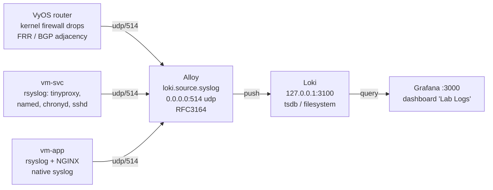

# Observability — Loki, Grafana and Alloy

The lab ships a self-contained logging stack on **`<prefix>-vm-obs`
(`10.1.10.31`)**, provisioned by `cloud-init-obs.yaml.tpl` and wired up from
`main-azvm-obs.tf`. Everything — collector, store and UI — runs on that single
VM, with no external dependency and no Internet access of its own.

Note that `vm-obs` is deliberately **not** in `local.router_egress_allowed`: it
downloads Grafana, Loki and Alloy through Tinyproxy like every other VM. That is
itself part of what the lab demonstrates.

## Pipeline



## Getting in

From the Jumphost desktop (Firefox passes VNet addresses through, bypassing the
proxy):

| URL | What |
|---|---|
| `http://10.1.10.31:3000` or `http://<prefix>-vm-obs.f5demo.lan:3000` | Grafana — default login **`admin` / `admin`** |
| `http://10.1.10.31:12345` | Alloy pipeline UI — component graph, health, live debug |
| `http://127.0.0.1:3100/ready` *(on the VM itself)* | Loki readiness — **loopback only** |

The **Lab Logs** dashboard is provisioned automatically into the `Lab` folder
(uid `lab-logs`). It is `allowUiUpdates: true`, so you can edit panels in the
browser, but the file on disk (`/var/lib/grafana/dashboards/lab-logs.json`) wins
on every redeploy.

## What sends logs, and how

| Source | Transport | Notes |
|---|---|---|
| **VyOS router** | `set system syslog remote 10.1.10.31 facility all level info` (udp/514) | Carries kernel firewall drops **and** FRR/BGP messages |
| **`vm-svc`** | rsyslog `*.* @10.1.10.31:514` | tinyproxy, named (incl. per-query logging), chronyd, sshd |
| **`vm-app`** | rsyslog `*.* @10.1.10.31:514` | chronyd, sshd, … |
| **`vm-app` NGINX** | NGINX native remote syslog | `facility=local7, tag=nginx`; access at `info`, error at `error`. A local copy is kept in `/var/log/nginx/access.log` for on-box work |
| **F5XC CEs** | *not collected* | `logs_streaming_disabled = true` on both sites — CE logs stay in the F5XC console |
| **`vm-jmp`** | *not collected* | no rsyslog forwarder installed |
| **`vm-obs`** itself | *not collected* | it is the collector; use `journalctl` locally |

## Labels — and why there are only four

Alloy promotes exactly four low-cardinality fields to Loki labels:

| Label | Source |
|---|---|
| `job` | always `syslog` |
| `host` | `__syslog_message_hostname` |
| `app` | `__syslog_message_app_name` (`kernel`, `nginx`, `tinyproxy`, `named`, `chronyd`, `sshd`, `bgpd`, …) |
| `severity` | `__syslog_message_severity` |

> **Do not add `SRC` / `DST` / `SPT` / `DPT` from the firewall lines as labels.**
> Every unique value creates a new Loki stream — thousands of them — and that is
> the classic way to make Loki fall over. Those fields stay in the log body and
> are extracted at **query time** with `| pattern`, as the dashboard does.

RFC3164 is used because that is what VyOS and stock rsyslog emit.

## The "Lab Logs" dashboard

Three template variables, all multi-select with an `All` option:

- **`$host`** — `label_values(host)`
- **`$app`** — `label_values(app)`
- **`$search`** — free-text regex box, applied as `|~ "$search"`

Four panels:

| Panel | Query |
|---|---|
| Log volume by app (stacked bars) | `sum by (app) (count_over_time({job="syslog", host=~"$host", app=~"$app"} \|~ "$search" [$__interval]))` |
| Logs | `{job="syslog", host=~"$host", app=~"$app"} \|~ "$search"` |
| Firewall drops — top destinations | `topk(10, sum by (dst) (count_over_time({app="kernel"} \|= "FWD-filter-90-D" \| pattern "<_>SRC=<src> DST=<dst> LEN=<_>" [$__interval])))` |
| Firewall drops — by source | `sum by (src) (count_over_time({app="kernel"} \|= "FWD-filter-90-D" \| pattern "<_>SRC=<src> DST=<dst> LEN=<_>" [$__interval]))` |

`FWD-filter-90-D` is the log prefix the VyOS kernel writes for forward-filter
rule 90 — the "you tried to bypass the proxy" drop.

> **LogQL gotcha**: consecutive captures in a `pattern` stage are illegal
> (`found consecutive capture '<dst><_>'`). There must be literal text between
> them — hence `... DST=<dst> LEN=<_>` rather than `... DST=<dst><_>`.

## Useful queries

```logql
# Everything the VyOS router dropped on egress
{app="kernel"} |= "FWD-filter-90-D"

# Who was dropped, aggregated by source
sum by (src) (count_over_time({app="kernel"} |= "FWD-filter-90-D" | pattern "<_>SRC=<src> DST=<dst> LEN=<_>" [5m]))

# BGP adjacency changes (needs the FRR informational tweak - see below)
{job="syslog"} |= "ADJCHANGE"

# Every request the origin actually served
{app="nginx"}

# What the lab browsed through the proxy
{app="tinyproxy"} |= "CONNECT"

# DNS queries hitting the lab resolver
{app="named"} |= "query:"

# Errors anywhere in the lab, last hour
{job="syslog", severity=~"err|crit|alert|emerg"}
```

## Configuration reference

### Loki

- Single binary, filesystem storage under `/var/lib/loki`, config at
  `/etc/loki/config.yml`
- `auth_enabled: false`, bound to **`127.0.0.1:3100`** — Grafana and Alloy are
  local and nothing else should talk to Loki directly
- schema **v13 + tsdb**, required for structured metadata (the OTLP ingestion path)
- Retention: `var.loki_retention_period`, default **`168h`** (7 days), with the
  compactor enabled (`retention_enabled: true`, `delete_request_store: filesystem`)
- `analytics.reporting_enabled: false` — this VM cannot reach the Internet
  directly and would otherwise produce periodic failed-connection noise
- Validated before start with `loki -verify-config`

> **Ownership trap**: the `loki` package creates the user with primary group
> `nogroup`; there is no `loki` group. `install -g loki` fails with "invalid
> group", the state directories are never created, and Loki crash-loops on
> `mkdir /var/lib/loki: permission denied` — which looks like a config fault but
> is not. Cloud-init therefore creates the directories first and then runs
> `chown -R loki:` (trailing colon = the user's own primary group).

### Alloy

- Config at `/etc/alloy/config.alloy`: `loki.source.syslog` →
  `loki.relabel.syslog_meta` → `loki.write.local`
- Validated before start with `alloy validate` (checks component wiring and
  arguments, not just syntax)
- UI exposed on the lab network via
  `CUSTOM_ARGS="--server.http.listen-addr=0.0.0.0:12345"` in `/etc/default/alloy`
  (default is loopback only)
- Alloy runs as the unprivileged `alloy` user, which cannot bind port 514. Rather
  than moving the lab to a non-standard port, a systemd drop-in
  (`/etc/systemd/system/alloy.service.d/10-bind-syslog-port.conf`) grants
  `CAP_NET_BIND_SERVICE`

### Grafana

- Loki datasource provisioned at
  `/etc/grafana/provisioning/datasources/loki.yaml` with **`uid: loki`** pinned so
  the dashboard can reference it

  > Safe on a **fresh** deploy only. Adding a `uid` to an already-provisioned
  > datasource makes Grafana fail with "Datasource provisioning error: data
  > source not found" and refuse to start at all — the provisioning failure
  > cascades into the HTTP server never coming up.

- Dashboard provider at `/etc/grafana/provisioning/dashboards/lab.yaml`, reading
  `/var/lib/grafana/dashboards`
- Environment appended to `/etc/default/grafana-server`:
  `GF_ANALYTICS_REPORTING_ENABLED=false`, `GF_ANALYTICS_CHECK_FOR_UPDATES=false`,
  the proxy variables, and the plugin flags below

**Grafana 13 unbundled the core datasources.** The binary ships only
alertmanager, cloudwatch, azuremonitor, testdata and graphite. Without the Loki
plugin, provisioning still registers the datasource in the DB (the API shows it,
correctly marked default) but the UI silently omits it from the picker, logging
only `"Could not find plugin definition for data source" datasource_type=loki`.

Grafana preinstalls plugins from grafana.com at startup, which is why it *must*
have the proxy in its environment: with no egress each attempt blocks ~10 s and
the HTTP server never comes up (observed: `/api/health` returning `000` after 80+
restarts). `NO_PROXY` must include `127.0.0.1`, or Grafana's own calls to Loki
would be sent to Tinyproxy.

```
GF_PLUGINS_PREINSTALL_DISABLED=true
GF_PLUGINS_PREINSTALL_SYNC=loki,grafana-lokiexplore-app
```

`PREINSTALL_DISABLED` suppresses Grafana's built-in default set — 18 plugins,
~492 MB (prometheus, elasticsearch, influxdb, mssql, mysql, tempo, jaeger,
zipkin …) — of which this lab uses exactly one. Note that an empty
`preinstall =` in `defaults.ini` does **not** disable it: the default list is
compiled into the binary and only this flag suppresses it. `PREINSTALL_SYNC` then
installs just what is wanted, *before* startup, which is what datasource
provisioning needs. Result: 61 MB instead of 492 MB.

Adding metrics later? Append the plugin id, e.g.
`GF_PLUGINS_PREINSTALL_SYNC=loki,grafana-lokiexplore-app,prometheus`.

### Versions

Packages come from `https://apt.grafana.com stable main` and are **unpinned on
purpose** for a lab. Versions this configuration was verified against, should you
want to pin them:

```
loki=3.7.7  grafana=13.2.0  alloy=1.19.2-1
```

## Self-checks at the end of cloud-init

`cloud-init-obs.yaml.tpl` finishes with assertions whose output lands in
`/var/log/cloud-init-output.log` — the first place to look if the stack is not
working:

- each of `loki`, `alloy`, `grafana-server` is active (else 25 journal lines)
- the `lab-logs` dashboard is present in `/api/search?type=dash-db`
- `"type":"loki"` appears in `/api/frontend/settings` (i.e. the plugin really loaded)
- `http://127.0.0.1:3100/ready` returns 200
- something is bound on udp/514

## Extending it

- **New syslog source** — point it at `10.1.10.31:514`; no Alloy change needed,
  the labels are derived from the syslog header.
- **Longer retention** — raise `loki_retention_period` in `terraform.tfvars`
  (Go duration, e.g. `720h`) and redeploy `vm-obs`.
- **Metrics** — add `prometheus.scrape` / `prometheus.remote_write` components to
  `config.alloy`, add the Prometheus plugin to `GF_PLUGINS_PREINSTALL_SYNC`, and
  run a Prometheus or Mimir alongside Loki.
- **A new dashboard** — drop the JSON into `/var/lib/grafana/dashboards`
  (provider polls every 30 s), then move it into the cloud-init template so it
  survives a rebuild.

---

## Related Documentation

- [⬅ Back to Documentation Index](./README.md)
- [Architecture](./10-architecture.md) — the log flow in context
- [Shared services](./40-shared-services.md) — the proxy this VM depends on
- [Troubleshooting](./30-troubleshooting.md) — when the stack itself is the problem
